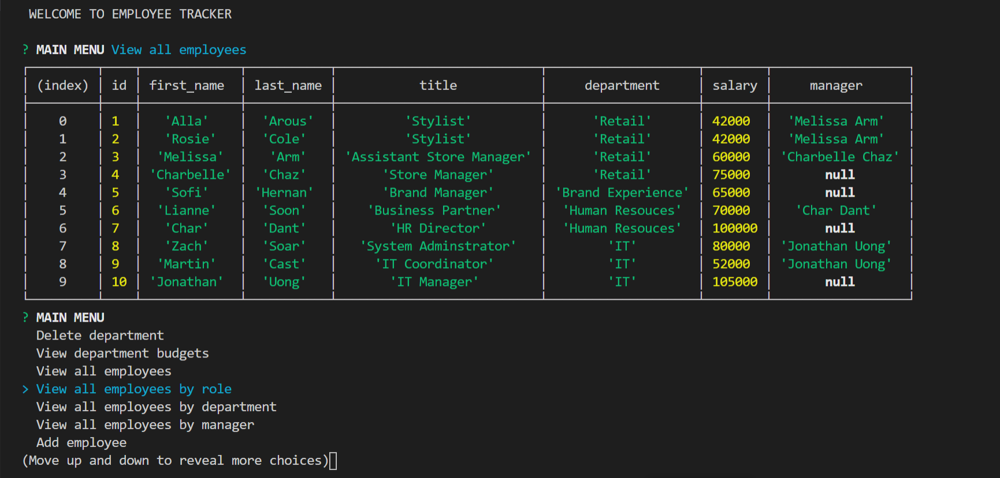

# Employee Tracker

Employee Tracker application is built for business owners to manage and view roles, departments, and employees in their companies. This application helps business owner to better plan and organize their business. 

This application allows user to do the following : 

- View all employeesby role, department, or manager
- Add an employee, role, or department
- Update an employee role or manager
- Delete employee, role, or department
- View department salary budgets

# Installation 

1. Run npm install for all dependencies installations. 
2. Run schema.sql in MySQL Workbench 

# Resources and Tools 

- Node.js Javascript environment 
- MySQL Workbench 

# Dependencies 

- inquirer - For the CLI user interface. This will prompt user within the CLI for employee information.
- mysql - Used to connect to the MySQL database and perform queries
- promise-mysql - Used to create promises from MySQL queries

